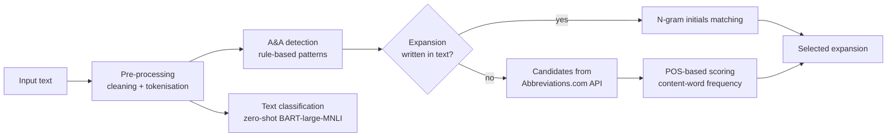

# Disambiguation of Abbreviations and Acronyms for NLP Applications

Code for the paper *Disambiguation of Abbreviations and Acronyms for Natural Language Processing Applications* (IEEE, 2026). DOI: [10.1109/LT68265.2026.11592568](https://doi.org/10.1109/LT68265.2026.11592568)

One abbreviation or acronym (A&A) can have many expansions. **AAA**, for example, can mean *American Association for Anatomy*, *Abdominal Aortic Aneurysm* or *Aromatic Amino Acid*. This project finds the A&As in an English text and picks the expansion that fits the context. It combines rule-based detection, zero-shot text classification and linguistic (POS-based) scoring.

## Pipeline



1. **Pre-processing**: normalise characters and tokenise with NLTK's Treebank tokenizer.
2. **Detection**: rules for upper-case tokens (`NLP`), plurals (`CEOs`), hyphenated forms (`COVID-19`) and dotted forms (`U.S.A.`).
3. **Text classification**: zero-shot classification with `facebook/bart-large-mnli` into ten domains (Academic & Science, Business, Computing, Medical, ...). The predicted domain is returned with the results.
4. **In-text expansion**: if the full form appears in the text, it is found by matching the A&A letters with the initials of n-grams of the same length.
5. **External candidates**: otherwise, candidate expansions come from the [Abbreviations.com (STANDS4) API](https://www.abbreviations.com/api.php).
6. **Linguistic scoring**: all candidates returned by the API are POS-tagged; each content word (noun, verb, adjective or adverb) that also appears in the text adds its frequency in the text to the score. The highest-scoring candidate is selected.

## Dataset and results

| | |
|---|---|
| A&As evaluated | 279 |
| Texts | 279 Wikipedia texts from several domains |
| Total words | 71,746 (14 to 4,023 words per text) |
| Correctly disambiguated | 260 / 279 |
| **Accuracy** | **93.19%** |

## How to run

**Google Colab (easiest)**

1. Open `Automatic_disambiguation_of_abbreviations_and_acronyms.ipynb` in Colab.
2. Get free API credentials from https://www.abbreviations.com/api.php.
3. In Colab, open the key icon (Secrets) and add `STANDS4_UID` and `STANDS4_TOKEN`.
4. Run all cells. The last cells show an example and let you try your own text.

**Locally**

```bash
pip install -r requirements.txt
export STANDS4_UID=your_uid
export STANDS4_TOKEN=your_token
jupyter notebook Automatic_disambiguation_of_abbreviations_and_acronyms.ipynb
```

Example output:

```text
Text category: <predicted domain>
  KAF        -> Kenya Air Force  (text)
```

## Repository contents

| File | Description |
|---|---|
| `Automatic_disambiguation_of_abbreviations_and_acronyms.ipynb` | Full pipeline with explanations and an example |
| `requirements.txt` | Python dependencies |

## Citation

```bibtex
@inproceedings{rizk2026disambiguation,
  title     = {Disambiguation of Abbreviations and Acronyms for Natural Language Processing Applications},
  author    = {Rizk, Nermeen and Alansary, Sameh A. and Seddeek, A. M. R. M. and Sarwat, N.},
  booktitle = {2026 23rd International Learning and Technology Conference (L\&T)},
  publisher = {IEEE},
  year      = {2026},
  doi       = {10.1109/LT68265.2026.11592568}
}
```

## Acknowledgment

I thank Abbreviations.com (STANDS4) for providing API access for research purposes.

## Author

Nermeen Rizk. This work was part of my MA thesis in Applied Linguistics.
